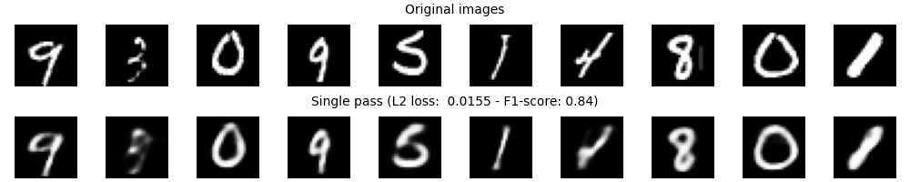
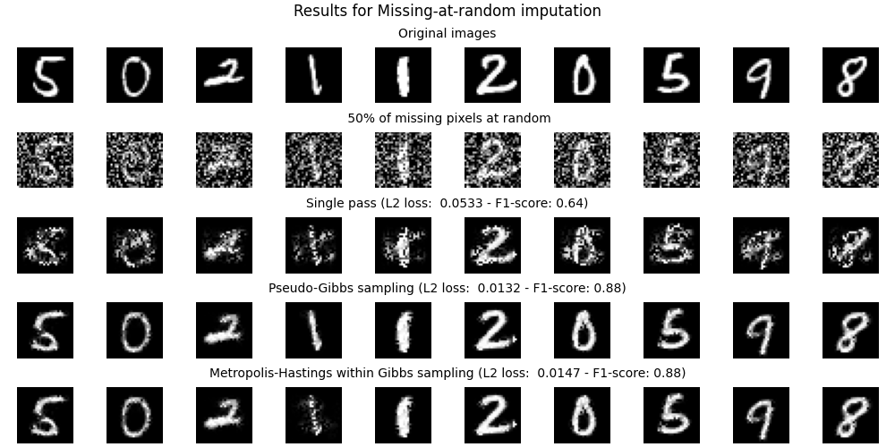
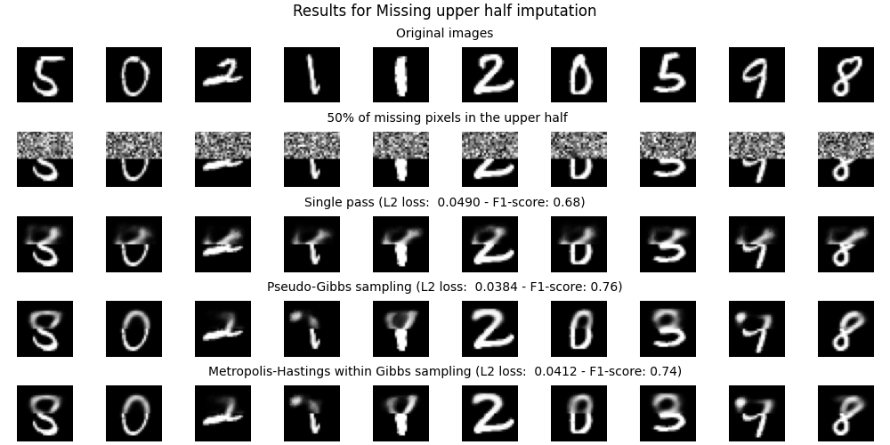

# Study of the Exact Likelihood of Deep Latent Variable Models

In this project, we implemented different Auto Encoder architectures, such as Variational Auto Encoder. Then, we implemented data imputation techniques as described by Kingma and Welling in their 2014 paper [*Auto-Encoding Variational Bayes*][vae] and by Mattei and Frellsen in their 2018 paper [*Leveraging the Exact Likelihood of Deep Latent Variable Models*][dlvm]. Our simple implementation aimed at comparing the data imputation abilities of different sampling procedures.

Please refer to the following sections for more information about the package usage:

1. [Some results](#some-results)
2. [Installation](#installation-instructions)
3. [Description](#package-description)
4. [Usage via command lines](#package-usage)
5. [Documentation](#documentation)

## Some Results

Here, we show the ability of Variational Auto Encoder to reconstruct images and impute missing data.

First, we plot original images above reconstructed ones using a trained Variational Auto Encoder.



Then, we plot original images above noisy images where a proportion of pixels are set to random values. Different sampling procedures are compared for data imputation.



Finally, we plot original images above noisy images where a proportion of the upper half of the image is set to random values. Different sampling procedures are compared for data imputation.



## Installation instructions

In order to use our package and run your own experiments, we advise you to set up a virtual environment. 

You will need Python 3 and the *virtualenv* package:

    pip3 install virtualenv

Then, create your virtual environment and switch to it:

    python3 -m venv venv

    source venv/bin/activate (Linux)
    .\venv\Scripts\Activate.ps1 (Windows PowerShell)

Finally, install all the requirements:

    pip3 install -r requirements.txt (Linux)
    pip3 install -r .\requirements.txt --extra-index-url https://download.pytorch.org/whl/cu117 (Windows)

*Note*: Tested on Linux with Python 3.10.8 and on Windows with Python 3.9.5, with CUDA 11.8+. For Windows, you might also need to install the corresponding CUDA Toolkit.

## Package description

Below, we give a brief tree view of our package.

    .
    ├── doc  # contains a generated documentation of src/ in html
    ├── src  # source code
    |   ├── nn  # Auto Encoder architectures
    |   |   ├── __init__.py
    |   |   ├── auto_encoder.py
    |   |   └── variational_auto_encoder.py
    |   ├── sampling  # sampling techniques for data imputation
    |   |   ├── __init__.py
    |   |   ├── iterative.py  # iterative imputing with *scikit-learn*
    |   |   ├── metropolis_hastings_w_gibbs.py
    |   |   ├── pseudo_gibbs.py
    |   |   └── single_pass.py  # direct reconstruction
    |   ├── __init__.py
    |   ├── training.py  # main file to train and evaluate Auto Encoders
    |   ├── imputation.py  # main file to perform data imputation
    |   └── utils.py
    ├── README.md
    └── requirements.txt  # contains the required Python packages to run our files

## Package usage

Our implementation of Auto Encoder architectures can be found under the *src/nn* folder. They can take as parameters an input dimension (which is usually of 784 for MNIST) and an encoding dimension which is by default of 32.

### Model training

You can either train an Auto Encoder by yourself or use our training function which can be found under *src/training.py*. This file allows to train some models for which we guarantee the compatibility with the rest of the package. The command is as follows:

    python3 src/training.py [options]

- `-h` or `--help`: Show all options and exit.
- `--seed`: Seed to use everywhere for reproducibility. Default: 42.
- `--model-name`: Name of the model following project usage. Available models: "ae" and "vae". Default: "vae".
- `--input-dim`: Dimension of the input images (after flattening). Default: 784.
- `--hidden-dim`: Hidden dimension of the Auto Encoder. Default: 128.
- `--encoding-dim`: Dimension of the encoded images. Default: 32.
- `--optim-name`: Name of the optimizer following project usage. Available optimizers: "adam". Default: "adam".
- `--lr`: Learning rate for the optimizer. Default: 0.001.
- `--weight-decay`: Weight decay for the optimizer. Default: 0.0.
- `--data-dir`: Data directory. Default: "data".
- `--batch-suze`: Training atch size. Default: 256.
- `--epochs`: Number of training epochs. Default: 10.
- `--noise`: Proportion of pixels set to zero during training. Default: 0.0.
- `--save`: If True, will save the last checkpoint of the model. Default: True.
- `--model-dir`: Checkpoints directory. Default: "models".

Example: We want to train a Variational Auto Encoder on MNIST, with all default parameters. We will train it for 20 epochs.

```bash
~ python3 src/training.py --model-name vae --epochs 20
Running on cuda.
Epoch 20/20; Train loss:  110.5803; Test loss:  109.8359: 100%|██████████████████████████| 20/20 [02:07<00:00,  6.38s/it]
```

*Note*: You can also train other Auto Encoder architectures with our training loop. You might also add a `--noise` argument to train more robust Auto Encoders (noise will be added during training, at random).

### Data imputation

Once you have trained a Variational Auto Encoder, you can use our package to perform data imputation using different sampling procedures which can be found under *src/sampling*.

Another file named *src/imputation.py* allows to compare the reconstruction of different sampling procedures. The command is as follows:

    python3 src/imputation.py [options]

- `-h` or `--help`: Show all options and exit.
- `--seed`: Seed to use everywhere for reproducibility. Default: 42.
- `--action`: Action to perform. If "mar", pixels are set as missing at random. If "half", upper half of the image is set as missing. Proportion of missing pixels is set using the `--noise` argument. Available actions: "mar" and "half". Default: "mar".
- `--input-dim`: Dimension of the input images (after flattening). Default: 784.
- `--hidden-dim`: Hidden dimension in the Auto Encoder. Default: 128.
- `--encoding-dim`: Dimension of the encoded images. Default: 32.
- `--data-dir`: Data directory. Default: "data".
- `--model-dir`: Checkpoints directory. Default: "models".
- `--nb-images`: Number of images to plot. Default: 10.
- `--noise`: Proportion of pixels set to zero in the noisy images. Default: 0.2.
- `--sampling-names`: Choose sampling names. Available sampling procedures: "simple", "gibbs", "mhwg", "ite_tree" and "ite_ridge". Default: "gibbs mhwg".
- `--gibbs-iter`: Number of pseudo-Gibbs sampling iterations. Default: 2000.
- `--mhwg-iter` : Number of Metropolis-Hastings within Gibbs iterations. Default: 2000.
- `--mhwg-gibbs`: Number of pseudo-Gibbs sampling during the initialization of the Metropolis-Hastings within Gibbs sampling. Default: 10.
- `--result-dir`: Plots directory. Default: "results".

Example: First, we would like to compare the ability of reconstructing original images for the Variational Auto Encoder. For this, we use the trick of setting the `--noise` argument to zero. Indeed, this will run a complete reconstruction of the image.

```bash
~ python3 src/imputation.py --noise 0 --sampling-names simple
Running on cuda.
Figures saved under results/mar_0.00_simple_[loss,f1,img].png.
```

Then, we can compare different sampling procedures for data imputation. Missing pixels are chosen at random with `--action mar` with a proportion of 50%. We should compare different strategies: Single pass sampling, pseudo-Gibbs sampling and Metropolis-Hastings within Gibbs sampling.

```bash
~ python3 src/imputation.py --action mar --noise 0.5 --sampling-names simple gibbs mhwg
Running on cuda.
100%|██████████████████████████| 20000/2000 [00:01<00:00, 400.46it/s]
100%|██████████████████████████| 10/10 [00:00<00:00, 400.96it/s]
100%|██████████████████████████| 20000/2000 [00:06<00:00, 200.42it/s]
Figures saved under results/mar_0.60_simple_gibbs_mhwg_[loss,f1,img].png.
```

Finally, we can compare again the different sampling strategies. However, this time missing pixels are chosen as the 50% upper half of pixels.

```bash
~ python3 src/imputation.py --action half --noise 0.5 --sampling-names simple gibbs mhwg
Running on cuda.
100%|██████████████████████████| 20000/2000 [00:01<00:00, 400.46it/s]
100%|██████████████████████████| 10/10 [00:00<00:00, 400.96it/s]
100%|██████████████████████████| 20000/2000 [00:06<00:00, 200.42it/s]
Figures saved under results/half_0.60_simple_gibbs_mhwg_[loss,f1,img].png.
```

## Documentation

A complete documentation is available in the *doc/src/* folder. If it is not
generated, you can run from the root folder:

```bash
pip3 install pdoc3
python3 -m pdoc -o doc/ --html --config latex_math=True --force src/
```

Then, open *doc/src/index.html* in your browser and follow the guide!

[//]: # (References)

[vae]: https://arxiv.org/abs/1312.6114
[dlvm]: https://arxiv.org/abs/1802.04826
